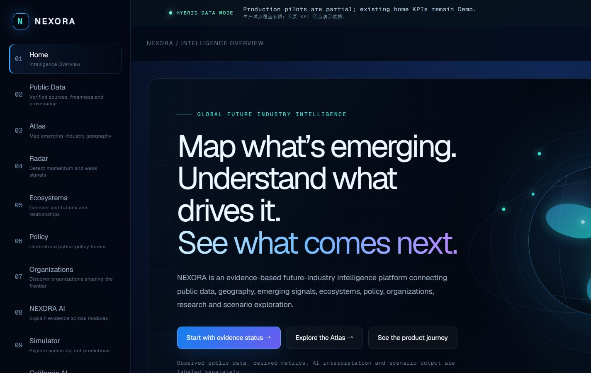
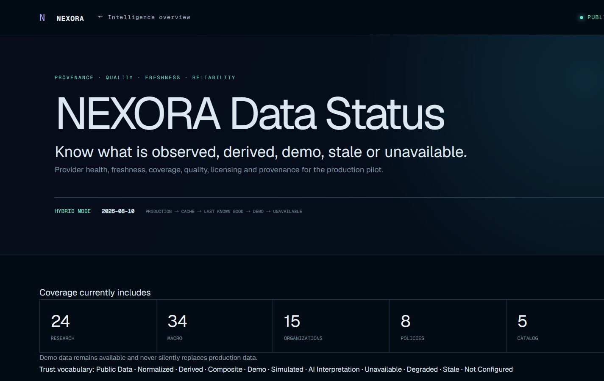
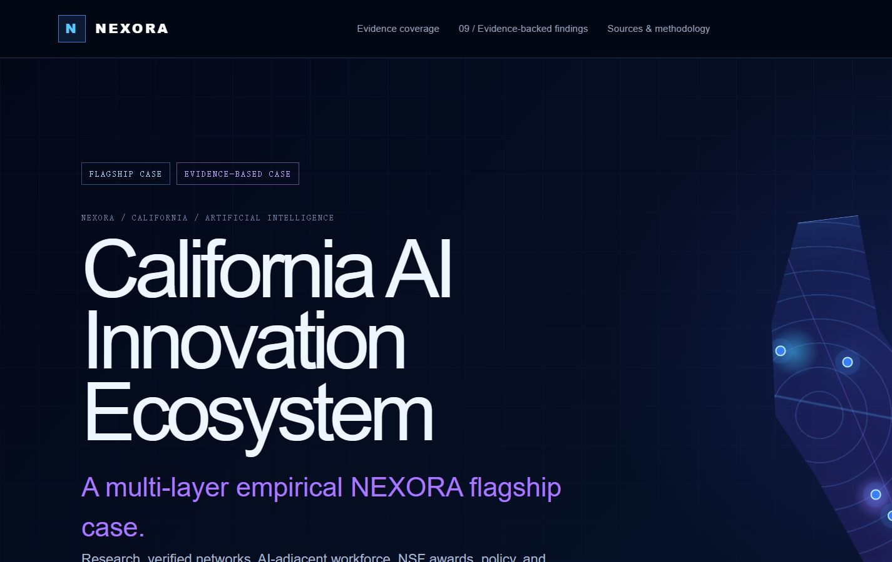

# NEXORA

**Evidence-based future-industry intelligence / 基于证据的未来产业情报**

NEXORA connects public data, geography, emerging signals, innovation networks, policy, organizations, evidence-grounded AI synthesis, and transparent scenarios. It is a research and exploration product—not an investment, legal, regulatory, or forecasting service.

NEXORA 连接公共数据、产业地理、新兴信号、创新网络、政策、组织、循证 AI 综合与透明情景模型。本项目用于研究与探索，不构成投资、法律、监管或预测服务。



| Evidence trust center | California AI flagship case |
|---|---|
|  |  |

## Public release candidate 1.0

- `/data-status` — provider coverage, provenance, freshness, quality, and license status
- `/atlas` — geographic context with explicit evidence modes
- `/radar` — emerging-signal exploration; composite scores are labeled Demo or Derived
- `/ecosystems` — organization-level network views; no people graph or private contacts
- `/policy` — official-policy context; no legal advice or causal impact claims
- `/companies` — public organization intelligence; no personal profiling
- `/ai` — deterministic, evidence-first synthesis with citations and refusal boundaries
- `/simulator` — scenario outputs under explicit assumptions; simulation is not prediction
- `/cases/california-ai` — a selected California AI evidence panel, not a statewide census

## Trust model

NEXORA keeps these states distinct: **Public Data, Normalized, Derived, Composite, Demo, Simulated, AI Interpretation, Unavailable, Degraded, Stale, and Not Configured**. Missing evidence remains unavailable; it is never replaced with fabricated or zero values.

Start with the in-product **Data Status** page. Public methods and limitations are summarized in [METHODOLOGY_PUBLIC.md](docs/METHODOLOGY_PUBLIC.md) and [DATA_ARCHITECTURE_PUBLIC.md](docs/DATA_ARCHITECTURE_PUBLIC.md).

The selected public evidence layers currently reference OpenAlex, World Bank, Data.gov, NSF, BLS, and official policy/organization sources. USPTO remains **Not Configured** and unsupported patent indicators remain unavailable. Provider terms and attribution are documented in the public license audit.

## Architecture and technology

The public product uses React 19, TypeScript, vinext/Vite, Cloudflare-compatible server rendering, typed domain/data layers, deterministic retrieval and scoring, and a transparent system-dynamics engine. See [ARCHITECTURE_PUBLIC.md](docs/ARCHITECTURE_PUBLIC.md) for the route-to-evidence flow. The public candidate requires no database or live AI provider to demonstrate core behavior.

## Local development

Requirements: Node.js `>=22.13.0`.

```bash
npm ci
npm run dev
npm run typecheck
npm run lint
npm test
```

Copy `.env.example` to `.env.local` only if optional server-side providers are needed. Never use `NEXT_PUBLIC_*` for credentials. The default public demo does not require a secret.

## Repository boundary

This source tree may coexist with private research work locally, but a public repository must be created only from the sanitized `.public-release/` candidate. Paper manuscripts, peer-review material, unpublished analysis, checkpoints, credentials, local databases, deployment metadata, and caches are excluded by design. See [PAPER01_PUBLIC_PRIVATE_BOUNDARY.md](docs/public-release/PAPER01_PUBLIC_PRIVATE_BOUNDARY.md).

## Reuse, security, and citation

- Application code: [MIT License](LICENSE); third-party datasets, fonts, and marks remain under their own terms.
- Security: [SECURITY.md](SECURITY.md) and [SECURITY_PUBLIC.md](docs/SECURITY_PUBLIC.md)
- Contributions: [CONTRIBUTING.md](CONTRIBUTING.md)
- Citation metadata: [CITATION.cff](CITATION.cff)
- Privacy and public-use disclaimer: [PRIVACY_PUBLIC.md](docs/PRIVACY_PUBLIC.md), [TERMS_PUBLIC.md](docs/TERMS_PUBLIC.md)

Version: `1.0.0` public release candidate. No DOI or public repository URL is claimed until an authorized release exists.

## Roadmap

The next authorized action is publication of this audited candidate—not a new Sprint or major feature. Later work may add validated providers, production performance monitoring, and a DOI-backed archival release, but only with the same provenance, licensing, privacy, and missing-data gates. Live demo URL: **pending explicit public-access authorization**.

NEXORA 是一个开放、研究导向的平台，用于探索新兴产业的演化、创新生态系统、机构能力以及区域技术发展。
该平台由武汉理工大学管理学院陈云在美国加州州立理工大学波莫纳分校（California State Polytechnic University, Pomona，Cal Poly Pomona）工商管理学院访学期间构思并开发。
NEXORA 主要面向研究人员、学生、教育工作者和分析人员，希望以更加直观、可访问的方式，帮助用户探索技术变迁、科研活动、创新生态系统和未来产业相关的公开信息。
NEXORA 是一个独立的学术与研究项目。文中提及武汉理工大学和 Cal Poly Pomona，仅用于说明项目创建者的学术任职与访学背景，并不意味着该平台由上述高校拥有、官方背书或正式资助。
为什么创建 NEXORA？
新兴技术与未来产业研究通常需要整合来自多个公开来源的信息。相关证据可能分散在科研数据库、政府开放数据、经济统计、机构记录以及其他开放信息系统中。NEXORA 希望将这些分散的信号组织到一个相对统一的分析环境中。
平台并不试图给出单一排名或确定性预测，而是帮助用户探索例如以下问题：
新兴科研与创新活动正在什么地方发展？
哪些机构和区域正在特定技术领域形成或增强能力？
科研专业化和合作网络如何随时间变化？
哪些信号可能反映新产业机会的形成？
研究结论对数据定义、分析边界和方法选择有多敏感？
NEXORA 的目标不是确定性地预测未来，而是让有关技术与产业变化的证据更容易被探索、比较和批判性评估。
以公开数据为基础
NEXORA 坚持“公开数据优先”的设计原则。公开平台使用公开可访问或开放许可的数据，其公共分析功能不依赖私有机构数据库或企业机密信息。
根据不同模块，数据来源可包括：
OpenAlex — 学术成果、研究机构、主题与科研关系
World Bank Open Data — 经济与发展指标
美国政府开放数据资源
美国劳工统计局（BLS）— 劳动力市场与职业相关指标
其他有明确说明的公开或开放获取数据源
NEXORA 对“观测/公开数据、衍生指标、演示数据、模拟结果、AI 生成解释以及不可用/降级数据”进行明确区分。这一设计是有意为之：用户不仅应当看到图表呈现了什么，也应当能够理解证据来自哪里，以及相关结果是如何形成的。
研究理念
透明性优先于黑箱评分。 重要指标应尽可能追溯到其定义和数据来源。
证据优先于预测。 情景工具和分析信号用于支持探索，而不是宣称能够作出确定性预测。
保持方法学审慎。 结果可能受到机构覆盖范围、领域定义、分类体系、阈值、时间窗口以及其他分析选择的影响。
在可行范围内追求可复现性。 在许可和研究边界允许的情况下，逐步公开和整理方法、文档与代码，使分析流程能够被检查和复现。
人的解释仍然不可替代。 AI 辅助解释可以帮助用户探索复杂信息，但不能替代学术判断和领域专业知识。
主要模块
Atlas — 从地理视角探索创新活动和新兴产业
Opportunity Radar — 用结构化信号探索潜在的新兴机会
Ecosystems — 分析机构与区域创新关系
Companies — 组织层面的探索性视图
Policy — 政策相关信号及背景信息
AI Intelligence — 在明确数据来源和可用性边界下提供 AI 辅助解释
Simulator — 用于情景探索；模拟情景不应被理解为预测
California AI Case — 以加州机构 AI 科研活动为案例，探索区域科研生态及方法敏感性
学术背景
NEXORA 的形成与创新和技术管理、新兴产业、科学计量与科研评价、区域创新生态、创业研究、人工智能以及循证决策支持等研究方向的交叉有关。
该项目形成于项目创建者在武汉理工大学管理学院开展学术工作的基础上，并在 Cal Poly Pomona 工商管理学院访学期间进一步构思和开发。这样的跨机构学术交流背景，为探索如何将公开数据、计算方法和 AI 辅助工具整合为一个更易于研究者使用的平台提供了环境与契机。
研究与公开发布边界
NEXORA 可以支持学术研究和方法实验，但公开网站与公开 GitHub 仓库不能替代同行评议论文。研究论文、尚未发表的分析、保密研究材料以及受限数据集均与公共平台分开管理。
在适当阶段，经过相应学术审查和正式发布后，相关论文、可复现材料和研究归档成果可以进一步与 NEXORA 建立链接。
负责任使用
NEXORA 用于研究、教育和探索性分析。平台不提供投资建议、法律建议、确定性预测或官方政府统计，也不提供由上述高校背书的机构排名。对于重要或具有实际后果的决策，用户应进一步查阅原始数据来源并咨询相应领域专家。
项目状态
NEXORA v1.0.0 — Public Release（公开版本）。项目仍在持续开发中，数据覆盖、分析方法、文档和研究模块将继续迭代。
链接
公共网站：NEXORA Public Website
GitHub：ChenYun135/NEXORA
引用
如果您在学术研究、教学或分析工作中使用NEXORA，请在正式引用信息可用后引用本项目或与之相关的学术成果。未来版本可进一步增加正式推荐引用格式和DOI。
许可与数据归属
源代码和项目材料适用本仓库所列许可协议。外部数据集仍分别遵循其数据提供方的使用条款、许可和署名要求。NEXORA不主张对第三方公开数据拥有所有权。
